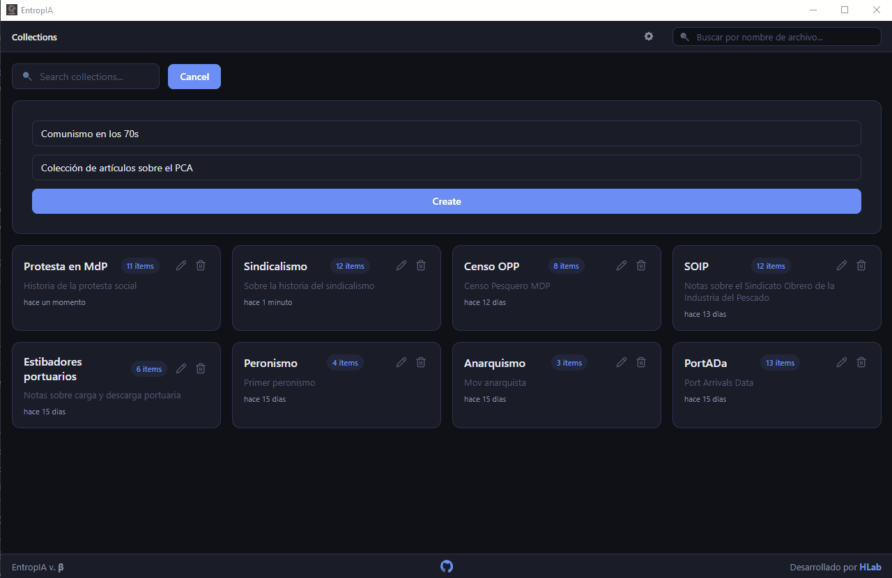

# EntropIA Pro

> ⚠️ **Release Pro inicial.** EntropIA Pro 0.1.0 está bootstrapped desde EntropIA Beta [`v0.0.22-bootstrap.16`](https://github.com/agusnieto77/EntropIA/releases/tag/v0.0.22-bootstrap.16).

## Herramienta de escritorio para corpus, OCR y análisis asistido

Desarrollado por [**HLab (Laboratorio de Humanidades Digitales)**](https://hlab.com.ar/).

**EntropIA Pro** es una app de escritorio open-source orientada a investigación en humanidades y ciencias sociales. Está pensada para trabajar con **imágenes, PDFs y audio** de forma **local/offline-first**, construir corpus y sumar capas de análisis asistido sobre las fuentes.

**Release actual:** `v0.1.0` de EntropIA Pro, basado en EntropIA Beta [`v0.0.22-bootstrap.16`](https://github.com/agusnieto77/EntropIA/releases/tag/v0.0.22-bootstrap.16).

> Si querés probar la app sin compilar, andá directo a [GitHub Releases](https://github.com/agusnieto77/EntropIA/releases).

## Vista rápida de la app

<p align="center">
  
</p>

<p align="center">
  <em>Vista general de EntropIA: colecciones, corpus y exploración documental en una app desktop offline-first.</em>
</p>

Hoy el foco del proyecto está en:

- **organización de corpus** en colecciones e ítems
- **OCR** para imágenes y PDFs
- **transcripción** de audio
- **extracción de entidades** y **triples**
- **FTS + embeddings** para búsqueda y similitud
- **anotaciones, notas y edición manual** sobre los resultados

## Qué ofrece hoy

### Ingesta y organización

- colecciones, ítems y assets locales
- soporte para **imágenes, PDFs y audio**
- persistencia local en **SQLite**

### Documentación técnica útil

- [SQLite schema y guía de inspección](./SQLite.md)
- [Alias en docs/database](./docs/database/SQLite.md)
- [Guía operativa de debugging de base](./DATABASE_DEBUGGING.md)
- [Script de auditoría SQLite](./scripts/sqlite_audit.sql)
- [Plan de worker persistente para OCRH](./OCRH_Persistent_Worker_Plan.md)

### OCR y transcripción

- **OCR Light (OCRL)**: OCR plano para imágenes y PDFs
- **OCR High (OCRH)**: modo con **PaddleOCR-VL** para extracción más rica y sensible al layout
- **OCRH premium**: persistencia de `blocks` + `regions`, overlay visual, filtros por tipo, navegación multipágina e inspector de bloques
- extracción de texto nativo desde PDF cuando la calidad lo permite
- transcripción de audio con **faster-whisper** vía subprocess de Python
- edición manual de OCR/transcripción con re-enriquecimiento posterior

### NLP y exploración

- **NER** liviano vía **Gemma/OpenRouter JSON** con categorías normalizadas (`PER`, `LOC`, `ORG`, `DATE`, `MISC`)
- extracción de **triples S-P-O**
- indexación **FTS**
- **embeddings** y búsqueda de ítems similares
- **topics** editables y sugerencias reutilizables
- visualización geográfica de entidades resueltas en mapa
- procesamiento en **background jobs** con eventos de progreso

### Trabajo sobre documentos

- visor de documento
- overlay de layout premium sobre imágenes y PDFs procesados con OCRH
- panel lateral de bloques OCR con selección, hover, filtros y navegación por página
- inspector de bloque con texto completo, bbox y metadatos de matching
- panel de entidades y triples por ítem y/o asset según el contexto activo
- **anotaciones** sobre assets
- **notas** asociadas al documento/asset activo
- edición de metadata

## OCRH premium: qué agrega sobre OCRL

Cuando un asset se procesa con **OCRH**, EntropIA ya no guarda solo texto plano. También persiste y expone estructura documental para inspección visual y análisis posterior.

### Persistencia

- `extractions` guarda el texto extraído
- `layouts` guarda:
  - `regions`
  - `blocks`
  - dimensiones de referencia
  - modelo/método

### UI premium actual

- toggle para mostrar/ocultar overlay
- bounding boxes sobre imagen/PDF
- lista de bloques con orden, label y preview
- selección sincronizada bloque ↔ overlay
- filtros por tipo (`títulos`, `texto`, `tablas`, `figuras`, `notas`)
- soporte multipágina en PDFs
- inspector de bloque con:
  - texto completo
  - `page`
  - `groupId`
  - `bbox`
  - `overlaySource`

### Limitación importante actual

OCRH sigue corriendo hoy en **CPU** vía subprocess de Python. La calidad estructural ya es alta, pero la latencia puede ser considerable. El plan de optimización futuro documentado en este repo se enfoca en un **worker persistente** para PaddleOCR-VL.

## Modelos usados hoy (por proceso)

| Proceso                                                          | Modelo / runtime actual                                                                           |
| ---------------------------------------------------------------- | ------------------------------------------------------------------------------------------------- |
| LLM local (OCR correction, summaries, triples, tareas asistidas) | **`gemma-4-E2B-it-Q4_K_M.gguf`** vía `llama.cpp` (`llama-cpp-2`), `n_ctx=4096`                    |
| Transcripción de audio                                           | **`faster-whisper/base`** vía subprocess de Python (`compute_type=int8`, idioma por defecto `es`) |
| Embeddings                                                       | **`baai/bge-m3`** vía OpenRouter embeddings API (`1024` dims)                                      |
| NER liviano                                                      | **Gemma/OpenRouter JSON** con salida normalizada a `PER`, `LOC`, `ORG`, `DATE`, `MISC`            |
| OCR High (OCRH)                                                  | **PaddleOCR-VL** vía `paddleocr[doc-parser]` en Python                                            |
| OCR nativo (cuando `paddle-ocr` está habilitado)                 | **`PP-OCRv5_mobile_det.mnn`** + **`latin_PP-OCRv5_mobile_rec_infer.mnn`**                         |
| Corrección de orientación OCR nativo                             | **`PP-LCNet_x1_0_doc_ori.mnn`**                                                                   |
| Detección de layout ONNX (hoy no activa en producción)           | **`PP-DocLayout-L.onnx`**                                                                         |

> Nota: varios pipelines tienen **degradación elegante**. Si falta un runtime, modelo o dependencia opcional, EntropIA intenta seguir funcionando con el mejor fallback disponible.

## Botones cableados hoy: UI → función → comando → backend

> En esta tabla, **LLMCloud** significa el proveedor remoto de inferencia LLM configurado en la app. Hoy puede ser OpenRouter, pero el provider puede cambiar.

> Referencia rápida de labels actuales en UI:
>
> - `OCRL` = OCR Light
> - `OCRH` = OCR High
> - `OCRC` = OCR Correction por LLM
> - `OCRR` = OCR/Transcription Summary por LLM
> - `TRIPLET` = extracción de triples semánticos por LLM

| Botón visible | Dónde aparece                | Archivo frontend                         | Función frontend                            | Comando Tauri                                       | Archivo backend                                        | Backend efectivo                                                                        |
| ------------- | ---------------------------- | ---------------------------------------- | ------------------------------------------- | --------------------------------------------------- | ------------------------------------------------------ | --------------------------------------------------------------------------------------- |
| `OCRL`        | Vista de ítem, sección OCR   | `apps/desktop/src/views/ItemView.svelte` | `handleExtractText(selectedAsset, 'light')` | `extract_text`                                      | `apps/desktop/src-tauri/src/ocr/commands.rs`           | **Local** (PaddleOCR liviano)                                                           |
| `OCRH`        | Vista de ítem, sección OCR   | `apps/desktop/src/views/ItemView.svelte` | `handleExtractText(selectedAsset, 'high')`  | `extract_text`                                      | `apps/desktop/src-tauri/src/ocr/commands.rs`           | **Local** (PaddleOCR-VL por Python; fallback a PaddleOCR liviano si falla o agota timeout) |
| `OCRC`        | Vista de ítem, sección OCR   | `apps/desktop/src/views/ItemView.svelte` | `handleLlmCorrectOcr()`                     | `llm_correct_ocr` / `llm_correct_ocr_asset`         | `apps/desktop/src-tauri/src/llm/commands.rs`           | **LLM local o LLMCloud**, según `llm_mode`                                              |
| `OCRR`        | Vista de ítem, sección OCR   | `apps/desktop/src/views/ItemView.svelte` | `handleLlmSummarize()`                      | `llm_summarize` / `llm_summarize_asset`             | `apps/desktop/src-tauri/src/llm/commands.rs`           | **LLM local o LLMCloud**, según `llm_mode`                                              |
| `Transcribe`  | Vista de ítem, sección audio | `apps/desktop/src/views/ItemView.svelte` | `handleTranscribeAudio(selectedAsset)`      | `transcribe_audio`                                  | `apps/desktop/src-tauri/src/transcription/commands.rs` | **Local** (Python + `faster-whisper`)                                                   |
| `OCRR`        | Vista de ítem, sección audio | `apps/desktop/src/views/ItemView.svelte` | `handleLlmSummarize()`                      | `llm_summarize` / `llm_summarize_asset`             | `apps/desktop/src-tauri/src/llm/commands.rs`           | **LLM local o LLMCloud**, según `llm_mode`                                              |
| `INDEX`       | Vista de ítem, sección NLP   | `apps/desktop/src/views/ItemView.svelte` | `handleIndexFts()`                          | `index_fts`                                         | `apps/desktop/src-tauri/src/nlp/commands.rs`           | **Local** (SQLite FTS)                                                                  |
| `EMBED`       | Vista de ítem, sección NLP   | `apps/desktop/src/views/ItemView.svelte` | `handleEmbedAsset()`                        | `embed_asset`                                       | `apps/desktop/src-tauri/src/nlp/commands.rs`           | **OpenRouter** (`baai/bge-m3`, asset-level, sin fallback Python)                        |
| `NER`         | Vista de ítem, sección NLP   | `apps/desktop/src/views/ItemView.svelte` | `handleExtractEntities()`                   | `extract_entities` / `extract_entities_for_asset`   | `apps/desktop/src-tauri/src/nlp/commands.rs`           | **OpenRouter/Gemma JSON** (`PER`, `LOC`, `ORG`, `DATE`, `MISC`; sin fallback spaCy)     |
| `TRIPLET`     | Vista de ítem, sección NLP   | `apps/desktop/src/views/ItemView.svelte` | `handleLlmExtractTriples()`                 | `llm_extract_triples` / `llm_extract_triples_asset` | `apps/desktop/src-tauri/src/llm/commands.rs`           | **LLM local o LLMCloud**, según `llm_mode`                                              |

### Capacidades implementadas pero no visibles todavía en la UI

| Capacidad                       | Wrapper frontend                                                  | Archivo frontend              | Comando Tauri                                         | Archivo backend                              | Backend efectivo                           | Estado UI       |
| ------------------------------- | ----------------------------------------------------------------- | ----------------------------- | ----------------------------------------------------- | -------------------------------------------- | ------------------------------------------ | --------------- |
| Q&A sobre colección             | `llmAsk(collectionId, question)`                                  | `apps/desktop/src/lib/llm.ts` | `llm_ask`                                             | `apps/desktop/src-tauri/src/llm/commands.rs` | **LLM local o LLMCloud**, según `llm_mode` | **No cableado** |
| Extracción de entidades por LLM | `llmExtractEntities(itemId)` / `llmExtractEntitiesAsset(assetId)` | `apps/desktop/src/lib/llm.ts` | `llm_extract_entities` / `llm_extract_entities_asset` | `apps/desktop/src-tauri/src/llm/commands.rs` | **LLM local o LLMCloud**, según `llm_mode` | **No cableado** |
| Clasificación por LLM           | `llmClassify(itemId, categories)`                                 | `apps/desktop/src/lib/llm.ts` | `llm_classify`                                        | `apps/desktop/src-tauri/src/llm/commands.rs` | **LLM local o LLMCloud**, según `llm_mode` | **No cableado** |

## Stack técnico real

| Capa          | Tecnología                                                                  |
| ------------- | --------------------------------------------------------------------------- |
| Desktop       | **Tauri 2** + Rust                                                          |
| Frontend      | **Svelte 5** + Vite                                                         |
| DB local      | **SQLite**                                                                  |
| Store/UI      | workspace packages (`@entropia/store`, `@entropia/ui`)                      |
| ORM cliente   | **Drizzle ORM**                                                             |
| OCR           | `ocr-rs` (feature `paddle-ocr`) + **PaddleOCR-VL** vía Python               |
| Transcripción | **faster-whisper** vía Python                                               |
| Embeddings    | **OpenRouter `baai/bge-m3`**                                                |
| NER           | **Gemma/OpenRouter JSON**                                                   |
| LLM local     | **llama.cpp** + GGUF (**Gemma 4 E2B IT Q4_K_M**)                            |

## Estado actual de la persistencia local

La base SQLite local ya guarda no solo entidades de negocio (`collections`, `items`, `assets`) sino también resultados derivados importantes del pipeline:

- `extractions` — OCR persistido
- `transcriptions` — audio transcripto
- `layouts` — estructura premium de OCRH (`blocks` + `regions`)
- `entities` / `triples` — enriquecimiento semántico
- `llm_results` — resultados persistidos de tareas LLM tipadas por target
- `fts_items`, `vec_assets` — búsqueda full-text y similitud asset-level

> Si necesitás inspeccionar o auditar esto en detalle, arrancá por [`SQLite.md`](./SQLite.md) y [`DATABASE_DEBUGGING.md`](./DATABASE_DEBUGGING.md).

## Instalación

### Descarga directa

Podés bajar instaladores desde [GitHub Releases](https://github.com/agusnieto77/EntropIA/releases).

| Sistema operativo   | Instalador           |
| ------------------- | -------------------- |
| Windows 10/11 (x64) | `.msi` o `.exe`      |
| macOS Apple Silicon | `.dmg`               |
| macOS Intel         | `.dmg`               |
| Linux               | `.deb` o `.AppImage` |

> En macOS, si aparece el warning de “desarrollador no identificado”, abrí con clic derecho → **Abrir**.

### Runtime-pack y alcance real del modo self-contained

EntropIA ahora incluye en el repo y en el bundle de Tauri la estructura `resources/runtime-pack/<platform>` para `windows-x86_64` y `linux-x86_64`.

- **Self-contained ahora**: contrato de manifiesto, estructura de payload, scripts administrados, placeholders de caches/wheelhouse, espejos de libs nativas, wiring de bundle, assembly script y smoke validation de runtime-pack.
- **Todavía no self-contained al 100% desde git**: los binarios pesados y redistribuibles reales NO se commitean acá. Siguen entrando por **release-time artifact injection** en CI/release.
- Eso pendiente incluye: Python relocatable real, wheelhouse offline real para OCR/transcripción (`faster-whisper`, `paddleocr`), caches/modelos presembrados y libs Linux auditadas. Embeddings livianos usan proveedores BGE-M3 configurados (OpenRouter API o Local ONNX), sin scripts legacy de embeddings.
- **Flujo de release**: primero se ejecuta el workflow **Runtime Payload** para producir el artifact `runtime-payloads`; después el workflow **Release** se ejecuta manualmente con `runtime_payload_artifact=runtime-payloads` y `runtime_payload_run_id=<run id>`. El job `runtime-pack` arma el runtime-pack final, valida smoke checks de release y recién ahí habilita el build de instaladores. El artifact `runtime-payloads-fixture` existe solo para CI/tests y NO es releasable.
- Los pushes de tags `v*` están protegidos: si no hay payload de runtime release verificable, el workflow falla antes de construir instaladores para no publicar builds con fixture runtime.

Mientras esos artifacts no se inyecten, los manifests del runtime-pack quedan marcados como `payload_profile: fixture` + `release_injection_required: true`, y la app reporta el runtime como incompatible para no mentir sobre soporte offline total.

### Compliance y firma

- Política de firma: [`CODE_SIGNING.md`](CODE_SIGNING.md)
- Privacidad: [`PRIVACY.md`](PRIVACY.md)
- Notices/payloads de terceros: [`THIRD_PARTY_NOTICES.md`](THIRD_PARTY_NOTICES.md)

### Qué necesitás para la experiencia completa hoy

La app puede abrirse y usarse sin tener todo el stack local instalado, pero algunas capacidades avanzadas todavía dependen de runtimes externos o de la futura inyección de artifacts de release.

| Capacidad                | Requiere                             |
| ------------------------ | ------------------------------------ |
| OCR básico (OCRL)        | PaddleOCR liviano incluido en el binario con feature `paddle-ocr` |
| OCR High (OCRH)          | Python + `paddleocr[doc-parser]`     |
| Transcripción            | Python + `faster-whisper`            |
| Embeddings               | OpenRouter API key (`baai/bge-m3`)   |
| NER liviano              | OpenRouter API key + modelo Gemma configurado |

> En la práctica, **Windows es hoy la plataforma mejor documentada y más verificada** para levantar el stack completo de OCR/NLP local.

## Desarrollo desde código fuente

### Requisitos generales

- **Node.js 22+**
- **pnpm 9**
- **Rust** (toolchain estable)

Dependencias base por sistema:

- **Linux (Ubuntu/Debian)**: `libwebkit2gtk-4.1-dev`, `libappindicator3-dev`, `librsvg2-dev`, `patchelf`
- **macOS**: Xcode Command Line Tools (`xcode-select --install`)
- **Windows**: WebView2 + toolchain MSVC

### Dependencias del frontend/desktop

```bash
git clone git@github.com:hlabrepo/EntropIA-Pro.git
cd EntropIA-Pro
pnpm install --frozen-lockfile
```

### Ejecutar en desarrollo

```bash
pnpm --filter @entropia-pro/desktop tauri dev
```

Para probar una build con identidad separada —útil para ramas de compliance o staging que no deberían compartir app data/instalador con `EntropIA`— usá:

```bash
pnpm desktop:dev:isolated
```

> Importante: en clones nuevos o cuando cambiás de sistema operativo, corré primero `pnpm install --frozen-lockfile`. Si no, Vite puede fallar resolviendo dependencias del workspace (por ejemplo `@tiptap/*`) aunque el código del repo esté bien.

### Validar sólo la app desktop

```bash
pnpm --filter @entropia-pro/desktop test
pnpm --filter @entropia-pro/desktop lint
pnpm --filter @entropia-pro/desktop typecheck
```

### Build

```bash
pnpm --filter @entropia-pro/desktop tauri build
```

## Requisitos adicionales para OCR/NLP local

La app puede **degradar con gracia** si faltan dependencias opcionales, pero para tener el stack completo de OCR, transcripción y NLP local necesitás herramientas adicionales.

### Windows

#### Toolchain nativo

- Visual Studio Build Tools 2022 (MSVC)
- LLVM/Clang para dependencias nativas que usan `bindgen`

#### LLVM

```powershell
choco install llvm -y
```

Variable recomendada:

```powershell
[System.Environment]::SetEnvironmentVariable("LIBCLANG_PATH", "C:\Program Files\LLVM\bin", "User")
```

#### Python y paquetes

Necesitás **Python 3.8+** con estos paquetes:

- `faster-whisper`
- `paddleocr[doc-parser]`
- `paddlepaddle` — **must be `>=3.2.1,<3.3.0`** (e.g. `3.2.2` is the verified sweet spot)

Ejemplo:

```powershell
pip install faster-whisper "paddleocr[doc-parser]" "paddlepaddle>=3.2.1,<3.3.0"
```

> **Version compatibility note for Linux dev:**
> - `paddlepaddle==2.6.2` is **incompatible** with `paddleocr>=3.x` (missing `AnalysisConfig.set_optimization_level`).
> - `paddlepaddle==3.3.1` has a **confirmed upstream bug** in CPU inference with oneDNN/PIR that crashes with `ConvertPirAttribute2RuntimeAttribute` (see [Paddle#77340](https://github.com/PaddlePaddle/Paddle/issues/77340)).
> - The documented working range is **3.2.1 – 3.2.2**.

> Recomendación práctica: si vas a desarrollar o validar OCR/NLP local de punta a punta, arrancá por **Windows**. Es el entorno con mejor cobertura documental y el más probado en este repo hoy.

## Scripts útiles del monorepo

Desde la raíz:

```bash
pnpm dev
pnpm build
pnpm lint
pnpm typecheck
pnpm test
pnpm desktop:dev:isolated
pnpm desktop:build:isolated
```

## Estado del proyecto

**Beta funcional**. Hoy ya existe un flujo usable para:

- importar fuentes
- correr OCR / transcripción
- enriquecer con NER / triples / FTS / embeddings asset-level
- navegar documentos y resultados
- editar texto extraído, metadata, notas y anotaciones

Todavía hay trabajo abierto en estabilidad, DX, roadmap de sync/export y refinamiento de algunos pipelines.

## Notas

- EntropIA privilegia **procesamiento local** y puede degradar algunas capacidades si faltan dependencias opcionales de Python o del toolchain nativo.
- El stack de OCR/NLP más completo hoy está **mejor documentado y más verificado en Windows**.
- Los instaladores publicados sirven para probar la app rápido; el stack local completo requiere dependencias adicionales si querés OCR/NLP avanzado.
- El roadmap sigue abierto para estabilidad, sync/export y refinamiento de pipelines.

---

**Powered by local compute.**
