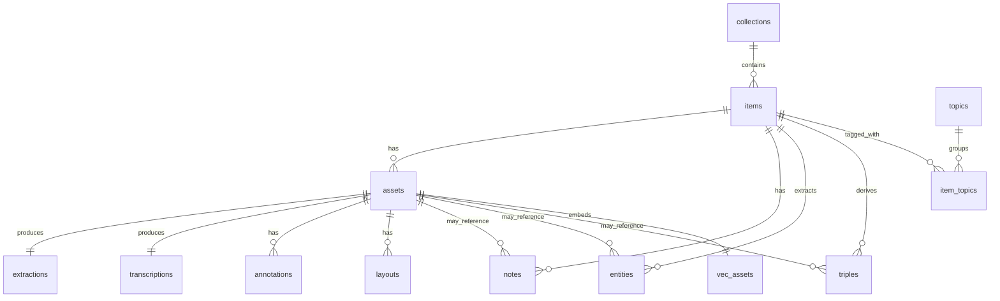

# EntropIA Pro SQLite

**Español:** [SQLite.md](./SQLite.md)

Documentation for the active EntropIA Pro SQLite database: where it lives, how to inspect it, and what the current schema looks like.

## Active database location

The active database detected for the current Tauri app is:

```text
%APPDATA%\com.entropia.pro.desktop\entropia.sqlite
```

The backend still recognizes a legacy database path to migrate older installations:

```text
%APPDATA%\com.entropia.app\entropia.sqlite
```

## Where this path comes from

- `apps/desktop/src-tauri/tauri.conf.json`
  - `identifier`: `com.entropia.pro.desktop`
  - `productName`: `EntropIA Pro`
- `apps/desktop/src-tauri/src/lib.rs`
  - uses `app.path().app_data_dir()`
  - creates/opens `entropia.sqlite` inside that directory

## Open the database

If you have `sqlite3` installed:

```powershell
sqlite3 "$env:APPDATA\com.entropia.pro.desktop\entropia.sqlite"
```

## Basic inspection commands

Inside `sqlite3`:

```sql
.tables
.schema
.schema assets
PRAGMA table_info(assets);
```

## Canonical FTS5 contract

The `fts_items` index is a **contentless** FTS5 table. The mandatory contract is:

- `fts_items.rowid = items.rowid`
- `item_id` is only an auxiliary payload, NOT the index identity
- every insert into the index must write an explicit `rowid`
- deletes by `item_id` are incompatible with this design and are NOT used
- when drift is suspected, the safe procedure is `delete-all + rebuild`

In the current database this is corrected with:

- baseline migration `0004_fts5.sql` using explicit `rowid`
- corrective migration `0018_fts_rowid_canonical.sql` for existing databases
- operational rebuild from app indexing flows whenever the index needs recomputation

## SQL script to list tables

```sql
SELECT name
FROM sqlite_master
WHERE type = 'table'
  AND name NOT LIKE 'sqlite_%'
ORDER BY name;
```

## SQL script to list table -> columns

```sql
SELECT
  m.name AS table_name,
  p.cid AS col_id,
  p.name AS column_name,
  p.type AS type,
  p."notnull" AS not_null,
  p.pk AS is_pk
FROM sqlite_master m
JOIN pragma_table_info(m.name) p
WHERE m.type = 'table'
  AND m.name NOT LIKE 'sqlite_%'
ORDER BY m.name, p.cid;
```

## Full SQL script for quick inspection

```sql
.tables

SELECT name
FROM sqlite_master
WHERE type = 'table'
  AND name NOT LIKE 'sqlite_%'
ORDER BY name;

PRAGMA table_info(_migrations);
PRAGMA table_info(annotations);
PRAGMA table_info(app_settings);
PRAGMA table_info(assets);
PRAGMA table_info(collections);
PRAGMA table_info(entities);
PRAGMA table_info(extractions);
PRAGMA table_info(fts_items);
PRAGMA table_info(fts_items_config);
PRAGMA table_info(fts_items_data);
PRAGMA table_info(fts_items_docsize);
PRAGMA table_info(fts_items_idx);
PRAGMA table_info(item_topics);
PRAGMA table_info(items);
PRAGMA table_info(layouts);
PRAGMA table_info(llm_results);
PRAGMA table_info(notes);
PRAGMA table_info(topics);
PRAGMA table_info(transcriptions);
PRAGMA table_info(triples);
PRAGMA table_info(vec_assets);
```

> If you inspect an old database and see `vec_items` or `embeddings_fallback`, treat them as legacy leftovers: the current runtime architecture only uses `vec_assets` for embeddings/similarity.

## Table classification

### Business tables

- `collections`
- `items`
- `assets`
- `notes`
- `topics`
- `item_topics`
- `annotations`
- `entities`
- `triples`
- `extractions`
- `transcriptions`
- `layouts`
- `llm_results`
- `app_settings`

### Technical / infrastructure tables

- `_migrations`
- `vec_assets`

### Legacy / archive (old snapshots only)

- `vec_items`
- `embeddings_fallback`

### FTS5 internal tables

- `fts_items`
- `fts_items_config`
- `fts_items_data`
- `fts_items_docsize`
- `fts_items_idx`

> Note: `fts_items_*` belongs to the full-text index and does not represent normal business entities.

> Important note: in EntropIA Pro, the real identity of the index is NOT `fts_items.item_id`, but `fts_items.rowid` aligned with `items.rowid`.

## Tree: database -> tables -> variables

### `entropia.sqlite`

#### `_migrations`

- `id`
- `name`
- `applied_at`

#### `annotations`

- `id`
- `asset_id`
- `page`
- `kind`
- `color`
- `x`
- `y`
- `width`
- `height`
- `created_at`
- `updated_at`

#### `app_settings`

- `key`
- `value`

#### `assets`

- `id`
- `item_id`
- `path`
- `type`
- `size`
- `created_at`
- `sort_index`

#### `collections`

- `id`
- `name`
- `description`
- `created_at`
- `updated_at`

#### `entities`

- `id`
- `item_id`
- `entity_type`
- `value`
- `start_offset`
- `end_offset`
- `confidence`
- `source`
- `model_name`
- `created_at`
- `latitude`
- `longitude`
- `geo_status`
- `asset_id`

#### `extractions`

- `id`
- `asset_id`
- `text_content`
- `method`
- `confidence`
- `created_at`

#### `fts_items`

- `item_id`
- `title`
- `metadata`
- `extracted_text`

#### `fts_items_config`

- `k`
- `v`

#### `fts_items_data`

- `id`
- `block`

#### `fts_items_docsize`

- `id`
- `sz`

#### `fts_items_idx`

- `segid`
- `term`
- `pgno`

#### `item_topics`

- `id`
- `item_id`
- `topic_id`
- `created_at`

#### `items`

- `id`
- `title`
- `collection_id`
- `metadata`
- `created_at`
- `updated_at`

#### `layouts`

- `id`
- `asset_id`
- `regions`
- `model`
- `image_width`
- `image_height`
- `created_at`

#### `llm_results`

- `id`
- `target_id`
- `target_type`
- `job_type`
- `result`
- `created_at`

#### `notes`

- `id`
- `item_id`
- `content`
- `created_at`
- `updated_at`
- `asset_id`

#### `topics`

- `id`
- `name`
- `created_at`

#### `transcriptions`

- `id`
- `asset_id`
- `text_content`
- `language`
- `duration_ms`
- `model`
- `segments`
- `confidence`
- `created_at`

#### `triples`

- `id`
- `item_id`
- `subject`
- `predicate`
- `object`
- `created_at`
- `asset_id`

#### `vec_assets`

- `asset_id`
- `item_id`
- `embedding`

## Conceptual relationships

```text
collections -> items -> assets -> (extractions, transcriptions, layouts, annotations)
items -> (notes, entities, triples, item_topics)
item_topics -> topics
```

## Mini ASCII ERD

```text
collections
  |
  | 1:N
  v
items
  |
  | 1:N
  v
assets
  ├── 1:1 -> extractions
  ├── 1:1 -> transcriptions
  ├── 1:N -> annotations
  └── 1:N -> layouts

items
  ├── 1:N -> notes
  ├── 1:N -> entities
  ├── 1:N -> triples
  └── N:M -> topics
            via item_topics

assets
  ├── 0..1 -> notes
  ├── 0..N -> entities
  └── 0..N -> triples

assets
  └── 1:1 -> vec_assets
```

### Quick ERD reading

- one `collection` groups many `items`
- one `item` can have many `assets`
- one `asset` concentrates persisted derived processing: OCR, transcription, layout, and annotations
- one `item` concentrates semantic knowledge: notes, entities, triples, and topics
- the relationship between `items` and `topics` is many-to-many through `item_topics`
- `vec_assets` supports asset-level embeddings and similarity
- `vec_items` and `embeddings_fallback` belong to legacy notes, not to the active runtime

## PK/FK by table

### `_migrations`

- PK: `id`
- FK: none

### `annotations`

- PK: `id`
- FK:
  - `asset_id -> assets.id`

### `app_settings`

- PK: `key`
- FK: none

### `assets`

- PK: `id`
- FK:
  - `item_id -> items.id`

### `collections`

- PK: `id`
- FK: none

### `entities`

- PK: `id`
- Conceptual FKs:
  - `item_id -> items.id`
  - `asset_id -> assets.id`

### `extractions`

- PK: `id`
- FK:
  - `asset_id -> assets.id`

### `fts_items`

- PK: virtual FTS5, no classic business PK
- Conceptual FK:
  - `item_id -> items.id`

### `fts_items_config`

- PK: `k`
- FK: none

### `fts_items_data`

- PK: `id`
- FK: internal FTS5

### `fts_items_docsize`

- PK: `id`
- FK: internal FTS5

### `fts_items_idx`

- Composite PK: `segid`, `term`
- FK: internal FTS5

### `item_topics`

- PK: `id`
- FK:
  - `item_id -> items.id`
  - `topic_id -> topics.id`

### `items`

- PK: `id`
- FK:
  - `collection_id -> collections.id`

### `layouts`

- PK: `id`
- FK:
  - `asset_id -> assets.id`

### `llm_results`

- PK: `id`
- Typed conceptual FK:
  - `target_type='asset' -> target_id -> assets.id`
  - `target_type='item' -> target_id -> items.id`
  - `target_type='collection' -> target_id -> collections.id`
  - `target_type='unknown'` reserved for non-inferable legacy rows

### `notes`

- PK: `id`
- Conceptual FKs:
  - `item_id -> items.id`
  - `asset_id -> assets.id`

### `topics`

- PK: `id`
- FK: none

### `transcriptions`

- PK: `id`
- FK:
  - `asset_id -> assets.id`

### `triples`

- PK: `id`
- Conceptual FKs:
  - `item_id -> items.id`
  - `asset_id -> assets.id`

### `vec_assets`

- PK: `asset_id`
- Conceptual FK:
  - `asset_id -> assets.id`
  - `item_id -> items.id`

## Mermaid ERD



### Note about real vs conceptual FKs

- Some relationships are backed by real SQLite foreign keys.
- Others appear by schema and code-use convention, even when they are not always enforced by an explicit constraint.
- This matters A LOT: the logical model and SQLite physical enforcement are different things.

## Observed real indexes and constraints

### Highlighted constraints by table

#### `_migrations`

- `PRIMARY KEY AUTOINCREMENT (id)`
- `UNIQUE (name)`
- `NOT NULL`: `name`, `applied_at`

#### `annotations`

- `PRIMARY KEY (id)`
- `FOREIGN KEY (asset_id) REFERENCES assets(id) ON DELETE CASCADE`
- `CHECK kind IN ('rectangle', 'underline')`
- `NOT NULL` on almost every operational column

#### `app_settings`

- `PRIMARY KEY (key)`
- `NOT NULL (value)`

#### `assets`

- `PRIMARY KEY (id)`
- `FOREIGN KEY (item_id) REFERENCES items(id)`
- `NOT NULL`: `item_id`, `path`, `type`, `created_at`, `sort_index`
- `DEFAULT sort_index = 0`

#### `collections`

- `PRIMARY KEY (id)`
- `NOT NULL`: `name`, `created_at`, `updated_at`

#### `entities`

- `PRIMARY KEY (id)`
- `FOREIGN KEY (item_id) REFERENCES items(id) ON DELETE CASCADE`
- `CHECK entity_type IN ('person','place','date','institution','organization','misc','custom')`
- `DEFAULT start_offset = 0`
- `DEFAULT end_offset = 0`
- `DEFAULT confidence = 1.0`
- `DEFAULT created_at = strftime('%s', 'now')`
- `DEFAULT geo_status = 'pending'`

#### `extractions`

- `PRIMARY KEY (id)`
- `FOREIGN KEY (asset_id) REFERENCES assets(id) ON DELETE CASCADE`
- `UNIQUE INDEX idx_extractions_asset_id_unique ON (asset_id)`
- `NOT NULL`: `asset_id`, `text_content`, `method`, `created_at`

#### `fts_items`

- virtual `FTS5` table
- `tokenize='unicode61 remove_diacritics 1'`
- `content=''` (contentless FTS)

#### `item_topics`

- `PRIMARY KEY (id)`
- `FOREIGN KEY (item_id) REFERENCES items(id) ON DELETE CASCADE`
- `FOREIGN KEY (topic_id) REFERENCES topics(id) ON DELETE CASCADE`
- `UNIQUE INDEX idx_item_topics_item_topic ON (item_id, topic_id)`

#### `items`

- `PRIMARY KEY (id)`
- `FOREIGN KEY (collection_id) REFERENCES collections(id)`
- `GENERATED ALWAYS STORED`: `search_text`
- `search_text = COALESCE(title, '') || ' ' || COALESCE(json(metadata), '')`

#### `layouts`

- `PRIMARY KEY (id)`
- `FOREIGN KEY (asset_id) REFERENCES assets(id) ON DELETE CASCADE`

#### `llm_results`

- `PRIMARY KEY (id)`
- `target_type CHECK ('asset' | 'item' | 'collection' | 'unknown')`
- no physical FK on `target_id`, but explicit scope through `target_type`

#### `notes`

- `PRIMARY KEY (id)`
- `FOREIGN KEY (item_id) REFERENCES items(id)`
- `asset_id` exists but has no explicit physical FK in the observed schema

#### `topics`

- `PRIMARY KEY (id)`
- `UNIQUE (name)`

#### `transcriptions`

- `PRIMARY KEY (id)`
- `FOREIGN KEY (asset_id) REFERENCES assets(id) ON DELETE CASCADE`
- `UNIQUE INDEX idx_transcriptions_asset_id_unique ON (asset_id)`

#### `triples`

- `PRIMARY KEY (id)`
- `FOREIGN KEY (item_id) REFERENCES items(id) ON DELETE CASCADE`
- `DEFAULT created_at = strftime('%s', 'now')`
- `asset_id` exists but has no explicit physical FK in the observed schema

#### `vec_assets`

- `PRIMARY KEY (asset_id)`
- `item_id NOT NULL`
- no explicit physical FKs in the observed schema

### Observed indexes

- `annotations_asset_id_idx` → `annotations(asset_id)`
- `annotations_asset_page_idx` → `annotations(asset_id, page)`
- `idx_assets_item` → `assets(item_id)`
- `idx_assets_item_sort` → `assets(item_id, sort_index)`
- `idx_entities_asset_id` → `entities(asset_id)`
- `idx_entities_geo_status` → `entities(geo_status)`
- `idx_entities_item_id` → `entities(item_id)`
- `idx_entities_type` → `entities(entity_type)`
- `idx_extractions_asset_id` → `extractions(asset_id)`
- `idx_extractions_asset_id_unique` → `extractions(asset_id)` **UNIQUE**
- `idx_item_topics_item_topic` → `item_topics(item_id, topic_id)` **UNIQUE**
- `idx_item_topics_topic_id` → `item_topics(topic_id)`
- `idx_items_collection` → `items(collection_id)`
- `idx_items_search` → `items(search_text)`
- `idx_layouts_asset_id` → `layouts(asset_id)`
- `idx_llm_results_target` → `llm_results(target_id)`
- `idx_llm_results_target_typed` → `llm_results(target_type, target_id, job_type)`
- `idx_notes_asset_id` → `notes(asset_id)`
- `idx_notes_item` → `notes(item_id)`
- `idx_transcriptions_asset_id` → `transcriptions(asset_id)`
- `idx_transcriptions_asset_id_unique` → `transcriptions(asset_id)` **UNIQUE**
- `idx_triples_asset_id` → `triples(asset_id)`
- `idx_vec_assets_item_id` → `vec_assets(item_id)`
- `triples_item_id_idx` → `triples(item_id)`

### Architectural implications

- `extractions` and `transcriptions` are effectively modeled as **1:1 per asset** because of their unique indexes on `asset_id`.
- `item_topics` prevents logical duplicates with the unique `(item_id, topic_id)` index.
- `items.search_text` is a generated column meant to speed up search/filtering.
- `notes.asset_id`, `triples.asset_id`, `entities.asset_id`, `vec_assets`, and `llm_results.target_id` do not always have a physical FK, so part of integrity depends on the app; in `llm_results`, `target_type` reduces ambiguity and enables explicit cleanup.

## SQL query for conceptual relationships

```sql
SELECT 'items -> collections' AS relationship, 'items.collection_id = collections.id'
UNION ALL
SELECT 'assets -> items', 'assets.item_id = items.id'
UNION ALL
SELECT 'notes -> items', 'notes.item_id = items.id'
UNION ALL
SELECT 'notes -> assets', 'notes.asset_id = assets.id'
UNION ALL
SELECT 'item_topics -> items', 'item_topics.item_id = items.id'
UNION ALL
SELECT 'item_topics -> topics', 'item_topics.topic_id = topics.id'
UNION ALL
SELECT 'annotations -> assets', 'annotations.asset_id = assets.id'
UNION ALL
SELECT 'entities -> items', 'entities.item_id = items.id'
UNION ALL
SELECT 'entities -> assets', 'entities.asset_id = assets.id'
UNION ALL
SELECT 'triples -> items', 'triples.item_id = items.id'
UNION ALL
SELECT 'triples -> assets', 'triples.asset_id = assets.id'
UNION ALL
SELECT 'extractions -> assets', 'extractions.asset_id = assets.id'
UNION ALL
SELECT 'transcriptions -> assets', 'transcriptions.asset_id = assets.id'
UNION ALL
SELECT 'layouts -> assets', 'layouts.asset_id = assets.id';
```

## Tables observed in the current inspection

The active database inspection returned these tables:

- `_migrations`
- `annotations`
- `app_settings`
- `assets`
- `collections`
- `entities`
- `extractions`
- `fts_items`
- `fts_items_config`
- `fts_items_data`
- `fts_items_docsize`
- `fts_items_idx`
- `item_topics`
- `items`
- `layouts`
- `llm_results`
- `notes`
- `topics`
- `transcriptions`
- `triples`
- `vec_assets`

## Architecture notes observed in code

- The app configures SQLite with:
  - `PRAGMA journal_mode=WAL;`
  - `PRAGMA foreign_keys=ON;`
- In `apps/desktop/src-tauri/src/lib.rs`, unique indexes by `asset_id` are forced for:
  - `extractions`
  - `transcriptions`
- The `layouts` table is ensured on startup for OCR/PaddleVL region persistence.
- `app_settings` is also ensured on startup for user configuration.

## Quick inspection recommendation

If you want to inspect EntropIA's functional core, start with these tables:

```sql
.schema items
.schema assets
.schema extractions
.schema transcriptions
.schema entities
.schema triples
```

## Useful queries by table

### `collections`

View collections ordered by date:

```sql
SELECT id, name, description, created_at, updated_at
FROM collections
ORDER BY created_at DESC;
```

### `items`

View items with their collection:

```sql
SELECT
  i.id,
  i.title,
  c.name AS collection_name,
  i.created_at,
  i.updated_at
FROM items i
JOIN collections c ON c.id = i.collection_id
ORDER BY i.created_at DESC;
```

### `assets`

View assets for an item:

```sql
SELECT id, item_id, path, type, size, sort_index, created_at
FROM assets
WHERE item_id = 'ITEM_ID_HERE'
ORDER BY sort_index, created_at;
```

### `extractions`

View OCR/extraction for an asset:

```sql
SELECT id, asset_id, method, confidence, created_at, text_content
FROM extractions
WHERE asset_id = 'ASSET_ID_HERE';
```

Search extractions by method:

```sql
SELECT asset_id, method, confidence, created_at
FROM extractions
WHERE method IN ('native', 'paddle_vl', 'paddle', 'pdf_paddle_vl', 'pdf_paddle')
ORDER BY created_at DESC;
```

### `transcriptions`

View transcription for an asset:

```sql
SELECT id, asset_id, language, duration_ms, model, confidence, created_at, text_content
FROM transcriptions
WHERE asset_id = 'ASSET_ID_HERE';
```

### `layouts`

View persisted OCR layout:

```sql
SELECT id, asset_id, model, image_width, image_height, created_at, regions
FROM layouts
WHERE asset_id = 'ASSET_ID_HERE';
```

### `annotations`

View annotations for an asset:

```sql
SELECT id, asset_id, page, kind, color, x, y, width, height, created_at, updated_at
FROM annotations
WHERE asset_id = 'ASSET_ID_HERE'
ORDER BY page, created_at;
```

### `notes`

View notes by item or asset:

```sql
SELECT id, item_id, asset_id, content, created_at, updated_at
FROM notes
WHERE item_id = 'ITEM_ID_HERE'
   OR asset_id = 'ASSET_ID_HERE'
ORDER BY updated_at DESC;
```

### `entities`

View entities for an item:

```sql
SELECT id, item_id, asset_id, entity_type, value, confidence, source, model_name, geo_status
FROM entities
WHERE item_id = 'ITEM_ID_HERE'
ORDER BY confidence DESC, value;
```

View resolved geographic entities:

```sql
SELECT value, latitude, longitude, geo_status, confidence
FROM entities
WHERE latitude IS NOT NULL
  AND longitude IS NOT NULL
ORDER BY confidence DESC;
```

### `triples`

View triples for an item:

```sql
SELECT id, item_id, asset_id, subject, predicate, object, created_at
FROM triples
WHERE item_id = 'ITEM_ID_HERE'
ORDER BY created_at DESC;
```

### `topics` + `item_topics`

View topics associated with an item:

```sql
SELECT t.id, t.name, it.created_at
FROM item_topics it
JOIN topics t ON t.id = it.topic_id
WHERE it.item_id = 'ITEM_ID_HERE'
ORDER BY t.name;
```

### `llm_results`

View persisted LLM results:

```sql
SELECT id, target_id, target_type, job_type, created_at, result
FROM llm_results
ORDER BY created_at DESC;
```

Check for legacy timestamps that remained in seconds (should NOT return rows):

```sql
SELECT id, target_id, target_type, job_type, created_at
FROM llm_results
WHERE created_at < 1000000000000
ORDER BY created_at ASC;
```

### `fts_items`

Search items by full-text:

```sql
SELECT item_id, title, snippet(fts_items, 3, '[', ']', '...', 12) AS preview
FROM fts_items
WHERE fts_items MATCH 'archivo OR documento'
LIMIT 20;
```

### `vec_assets`

Quick inspection of persisted embeddings:

```sql
SELECT asset_id, item_id, length(embedding) AS embedding_bytes
FROM vec_assets
LIMIT 20;
```

## Cross-debugging queries

### View one full item with collection and assets

```sql
SELECT
  c.name AS collection_name,
  i.id AS item_id,
  i.title,
  a.id AS asset_id,
  a.type AS asset_type,
  a.path,
  a.sort_index
FROM items i
JOIN collections c ON c.id = i.collection_id
LEFT JOIN assets a ON a.item_id = i.id
WHERE i.id = 'ITEM_ID_HERE'
ORDER BY a.sort_index, a.created_at;
```

### View which assets already have OCR/transcription/layout

```sql
SELECT
  a.id AS asset_id,
  a.type,
  CASE WHEN e.asset_id IS NOT NULL THEN 1 ELSE 0 END AS has_extraction,
  CASE WHEN t.asset_id IS NOT NULL THEN 1 ELSE 0 END AS has_transcription,
  CASE WHEN l.asset_id IS NOT NULL THEN 1 ELSE 0 END AS has_layout
FROM assets a
LEFT JOIN extractions e ON e.asset_id = a.id
LEFT JOIN transcriptions t ON t.asset_id = a.id
LEFT JOIN layouts l ON l.asset_id = a.id
WHERE a.item_id = 'ITEM_ID_HERE'
ORDER BY a.sort_index, a.created_at;
```

### View consolidated text by asset

```sql
SELECT
  a.id AS asset_id,
  a.path,
  e.text_content AS extraction_text,
  t.text_content AS transcription_text
FROM assets a
LEFT JOIN extractions e ON e.asset_id = a.id
LEFT JOIN transcriptions t ON t.asset_id = a.id
WHERE a.item_id = 'ITEM_ID_HERE';
```

### View semantic enrichment by item

```sql
SELECT
  i.id,
  i.title,
  (SELECT COUNT(*) FROM entities en WHERE en.item_id = i.id) AS entity_count,
  (SELECT COUNT(*) FROM triples tr WHERE tr.item_id = i.id) AS triple_count,
  (SELECT COUNT(*) FROM notes n WHERE n.item_id = i.id) AS note_count,
  (SELECT COUNT(*) FROM item_topics it WHERE it.item_id = i.id) AS topic_count
FROM items i
WHERE i.id = 'ITEM_ID_HERE';
```

## Where to look depending on the problem

### “My collection or item does not show up”

- look at `collections`
- look at `items`
- verify `items.collection_id`

Useful query:

```sql
SELECT i.id, i.title, i.collection_id, c.name
FROM items i
LEFT JOIN collections c ON c.id = i.collection_id
ORDER BY i.created_at DESC;
```

### “The asset is loaded but does not process”

- look at `assets`
- look at `extractions`, `transcriptions`, `layouts`

Useful query:

```sql
SELECT
  a.id,
  a.path,
  a.type,
  CASE WHEN e.asset_id IS NOT NULL THEN 1 ELSE 0 END AS has_extraction,
  CASE WHEN t.asset_id IS NOT NULL THEN 1 ELSE 0 END AS has_transcription,
  CASE WHEN l.asset_id IS NOT NULL THEN 1 ELSE 0 END AS has_layout
FROM assets a
LEFT JOIN extractions e ON e.asset_id = a.id
LEFT JOIN transcriptions t ON t.asset_id = a.id
LEFT JOIN layouts l ON l.asset_id = a.id
WHERE a.id = 'ASSET_ID_HERE'
LIMIT 1;
```

### “OCR failed”

- look at `extractions.method`
- look at `extractions.confidence`
- look at `layouts` if it was OCR High

### “Transcription failed”

- look at `transcriptions`
- review whether a row exists and which metadata/model it has

### “I cannot see entities or triples”

- look at `entities`
- look at `triples`
- verify that the correct `item_id` or `asset_id` exists first

### “The topic does not appear associated”

- look at `topics`
- look at `item_topics`

### “Full-text search returns nothing”

- look at `fts_items`
- validate that the item was indexed

Useful query:

```sql
SELECT item_id, title, metadata, extracted_text
FROM fts_items
WHERE item_id = 'ITEM_ID_HERE';
```

### “Similarity / embeddings are not working”

- look at `vec_assets`
- validate that `embedding` is not empty

Useful query:

```sql
SELECT asset_id, item_id, length(embedding) AS bytes
FROM vec_assets
WHERE asset_id = 'ASSET_ID_HERE';
```

> Legacy file note: if an old database still keeps `vec_items` or `embeddings_fallback`, they are not part of the current runtime/product contract.

## Quick debugging checklist

```text
1. Does the collection exist?
2. Does the item exist and point to the right collection?
3. Do assets exist for that item?
4. Was extraction or transcription persisted?
5. Was layout/annotation generated if applicable?
6. Were entities/triples/topics generated?
7. Was FTS or embeddings indexing generated if the flow required it?
```

> Compatibility: existing databases may include a legacy `jobs` table created by old migrations. The current cleanup removes it with `0021_drop_unused_processing_table`; it is not part of the supported runtime schema.
